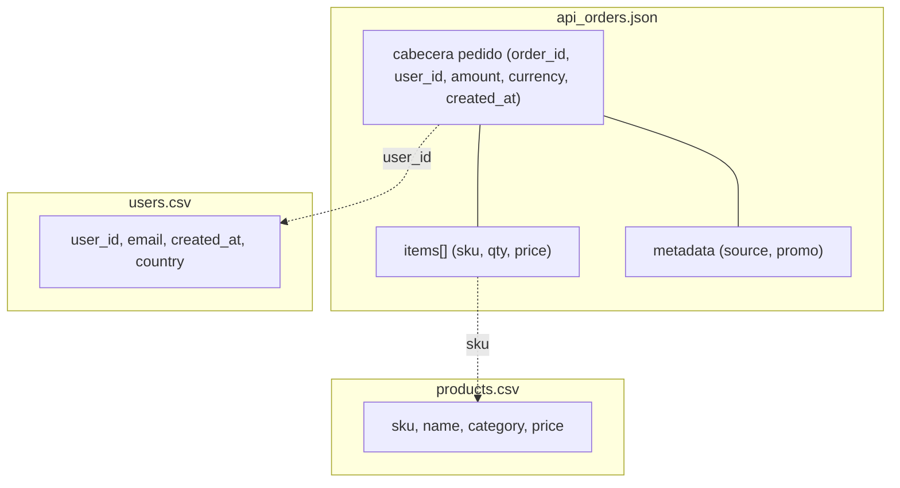
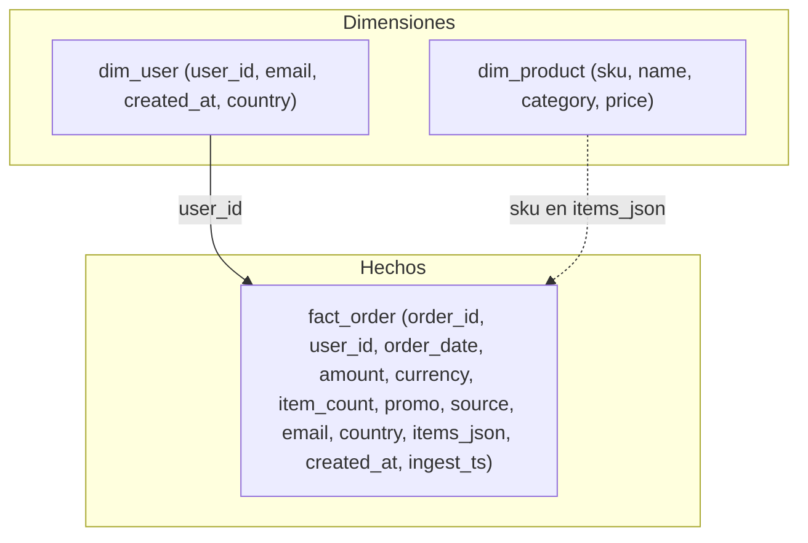

# Modelo de datos

Fuentes vs salida (como en `sql/redshift-ddl.sql`). Join pedido–usuario: DuckDB en memoria + `read_csv_auto` sobre usuarios.

Si el preview no dibuja nada: extensión **Markdown Preview Mermaid** en Cursor/VS Code, o abrí el archivo en GitHub (render Mermaid en bloques fenced).

## Entradas

## Curated (Parquet / Redshift)

Línea punteada: no hay FK física pedido→producto; los sku van en el JSON de líneas.
